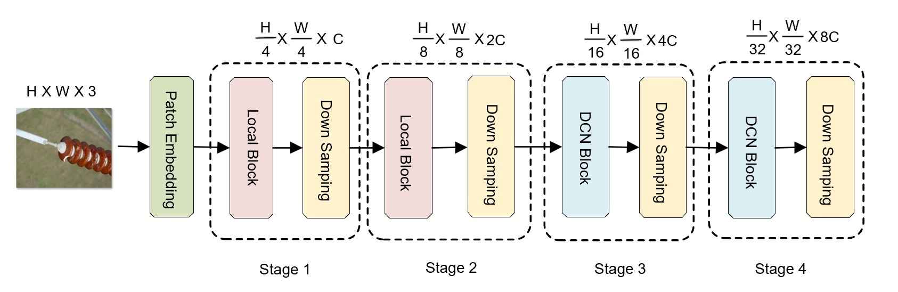

## system env:
1. Ubuntu: 22.04 
2. Python: 3.10.13
3. PyTorch: 2.2.2+cu118
4. C++ Version: 201703

## packages installation
### - DCNv4
1. copy DCNv4_op folder to your project from implementation code of DCNv4 paper:https://github.com/OpenGVLab/DCNv4 
2. locate root path of DCNv4_op
3. check if '/usr/local/cuda 11.8/bin' exist or not
4. if not, install cuda 11.8 or high version, you can use wget to download:wget https://developer.download.nvidia.com/compute/cuda/11.8.0/local_installers/cuda_11.8.0_520.61.05_linux.run and install(sudo sh cuda_11.8.0_520.61.05_linux.run)
5. set path into environment even cuda 11.8 installed:
6. export PATH=/usr/local/cuda-11.8/bin:$PATH
7. export LD_LIBRARY_PATH=$LD_LIBRARY_PATH:/usr/local/cuda-11.8/lib64
8. export CUDA_HOME=/usr/local/cuda-11.8
9. pip install ninja
10. apt-get update
11. sudo apt install g++
12. bash ./make.sh
13. please don't care about many logs during installation
14. DCNv4:1.0.0 in your pip list after completion, it means installation is done.
### - other dependencies
1. pip install terminaltables
2. pip install fvcore
3. pip install timm==0.6.5
4. pip install scipy
5. pip install mmcv==2.1.0
6. pip install pycocotoos


### architecture


## Train
```
python -m torch.distributed.launch  --nproc_per_node=1 --master_port=12346 --use_env main.py --data-path  /root/data/imagenet --model multiscalelgtformer_tiny --batch-size 128 --lr 1e-3 --drop-path 0.1 --epoch 300 --dist-eval --output_dir /root/output/imagenet
```

## Evaluation
```
python -m torch.distributed.launch  --nproc_per_node=1 --master_port=12346 --use_env main.py --data-path  /root/data/tiny-imagenet-200 --model multiscalelgtformer_tiny --batch-size 128 --lr 1e-3 --drop-path 0.1 --epoch 300 --eval --output_dir /root/output
```

## image classification on CIFAR-100
### DADCN-ViT_T(tiny version):
| module                       | #parameters or shape   | #flops     |
|:-----------------------------|:-----------------------|:-----------|
| model                        | 22.938M                | 3.496G     |
|  patch_embed.proj            |  65.168K               |  0.445G    |
|   patch_embed.proj.0         |   0.432K               |   21.676M  |
|    patch_embed.proj.0.weight |    (16, 3, 3, 3)       |            |
|   patch_embed.proj.1         |   32                   |   1.606M   |
|    patch_embed.proj.1.weight |    (16,)               |            |
|    patch_embed.proj.1.bias   |    (16,)               |            |
|   patch_embed.proj.3         |   4.608K               |   57.803M  |
|    patch_embed.proj.3.weight |    (32, 16, 3, 3)      |            |
|   patch_embed.proj.4         |   64                   |   0.803M   |
|    patch_embed.proj.4.weight |    (32,)               |            |
|    patch_embed.proj.4.bias   |    (32,)               |            |
|   patch_embed.proj.6         |   18.432K              |   0.231G   |
|    patch_embed.proj.6.weight |    (64, 32, 3, 3)      |            |
|   patch_embed.proj.7         |   0.128K               |   1.606M   |
|    patch_embed.proj.7.weight |    (64,)               |            |
|    patch_embed.proj.7.bias   |    (64,)               |            |
|   patch_embed.proj.9         |   41.472K              |   0.13G    |
|    patch_embed.proj.9.weight |    (72, 64, 3, 3)      |            |
|  stages                      |  22.755M               |  3.051G    |
|   stages.0                   |   0.223M               |   0.48G    |
|    stages.0.blocks           |    0.129M              |    0.407G  |
|    stages.0.downsample.proj  |    93.744K             |    73.382M |
|   stages.1                   |   1.388M               |   0.87G    |
|    stages.1.blocks           |    1.014M              |    0.797G  |
|    stages.1.downsample.proj  |    0.374M              |    73.27M  |
|   stages.2                   |   7.371M               |   1.223G   |
|    stages.2.blocks           |    5.876M              |    1.15G   |
|    stages.2.downsample.proj  |    1.495M              |    73.213M |
|   stages.3                   |   13.773M              |   0.477G   |
|    stages.3.blocks           |    7.798M              |    0.382G  |
|    stages.3.downsample.proj  |    5.975M              |    95.588M |
|  norm                        |  2.304K                |  92.16K    |
|   norm.weight                |   (1152,)              |            |
|   norm.bias                  |   (1152,)              |            |
|  head                        |  0.115M                |  0.115M    |
|   head.weight                |   (100, 1152)          |            |
|   head.bias                  |   (100,)               |            |

### test result
- [result](https://github.com/durrenlee/IMTNet/tree/main/classification/result/test-log.txt)

### checkpoint