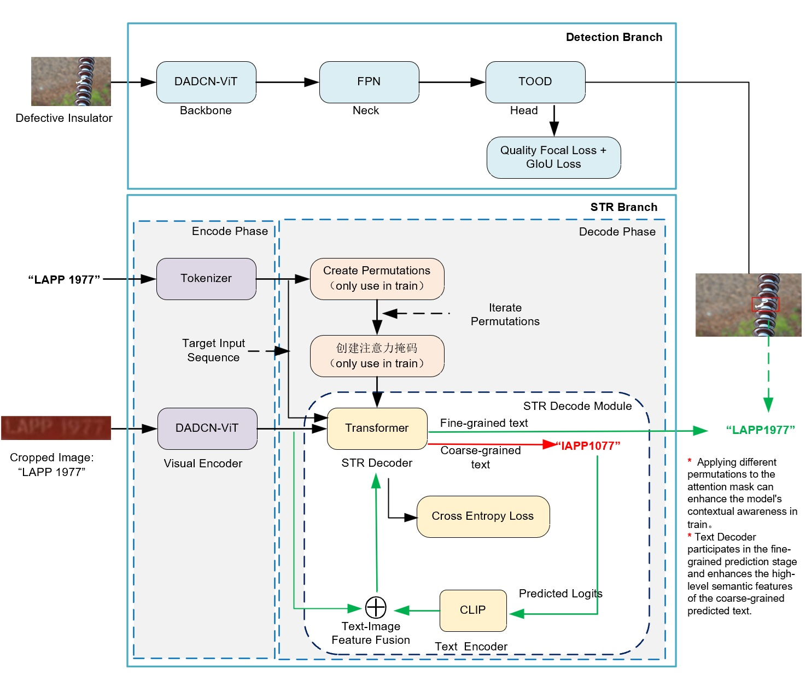

## system env:
1. Ubuntu: 22.04 
2. Python: 3.10.13
3. PyTorch: 2.2.2+cu118
4. C++ Version: 201703

## packages installation
1. pip install fqdn==1.5.1
2. pip install ftfy==6.2.3
3. pip insall hydra-core==1.3.2
4. pip install imageio==2.35.1
5. pip install imgaug==0.4.0
6. pip install lightning-utilities==0.11.7
7. pip install lmdb==1.5.1
8. mmdet: locate detection folder and pip install -v -e.
9. pip install nltk==3.9.1
10. pip install numpy==1.26.4
11. pip install pytorch-lightning==1.9.4
12. pip install scipy
13. pip install shapely==2.0.6
14. pip install tensorboard==2.17.0
15. [DCNv4 installation](../../classification/README.md)

### architecture

## Train
bash insulator_det_str.sh

## TEST
1. bash test.sh 0 last.ckpt
2. [test log](../insulator_detection/result/test.txt)

## Inference
bash read.sh 0 checkpoint.ckpt /YOUR TEST IMAGES FOLDER/

